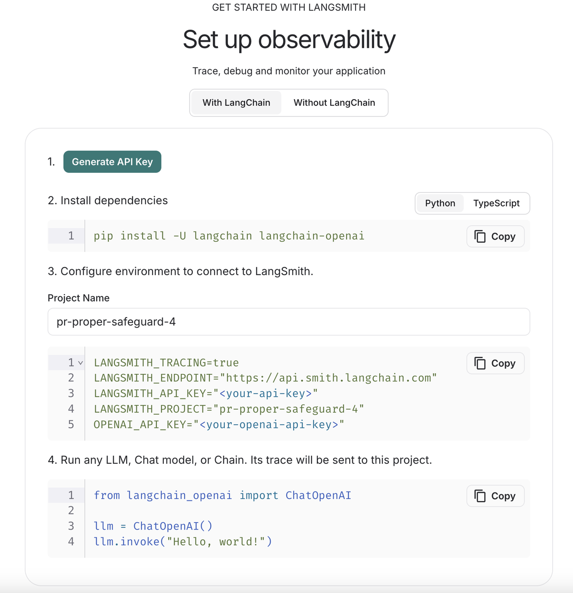

### 配置环境


```python
!conda create -n langchain-demo python==3.10 -y # conda环境搭建
!pip install langchain langchain-community openai python-dotenv # 下载必要包
```

    Channels:
     - defaults
    Platform: osx-arm64
    Collecting package metadata (repodata.json): done
    Solving environment: done
    
    ## Package Plan ##
    
      environment location: /opt/anaconda3/envs/langchain-demo
    
      added / updated specs:
        - python==3.10
    
    
    The following NEW packages will be INSTALLED:
    
      bzip2              pkgs/main/osx-arm64::bzip2-1.0.8-h80987f9_6 
      ca-certificates    pkgs/main/osx-arm64::ca-certificates-2025.2.25-hca03da5_0 
      libffi             pkgs/main/osx-arm64::libffi-3.4.4-hca03da5_1 
      ncurses            pkgs/main/osx-arm64::ncurses-6.4-h313beb8_0 
      openssl            pkgs/main/osx-arm64::openssl-1.1.1w-h1a28f6b_0 
      pip                pkgs/main/osx-arm64::pip-25.0-py310hca03da5_0 
      python             pkgs/main/osx-arm64::python-3.10.0-hbdb9e5c_5 
      readline           pkgs/main/osx-arm64::readline-8.2-h1a28f6b_0 
      setuptools         pkgs/main/osx-arm64::setuptools-75.8.0-py310hca03da5_0 
      sqlite             pkgs/main/osx-arm64::sqlite-3.45.3-h80987f9_0 
      tk                 pkgs/main/osx-arm64::tk-8.6.14-h6ba3021_0 
      tzdata             pkgs/main/noarch::tzdata-2025a-h04d1e81_0 
      wheel              pkgs/main/osx-arm64::wheel-0.45.1-py310hca03da5_0 
      xz                 pkgs/main/osx-arm64::xz-5.6.4-h80987f9_1 
      zlib               pkgs/main/osx-arm64::zlib-1.2.13-h18a0788_1 
    
    
    
    Downloading and Extracting Packages:
    
    Preparing transaction: done
    Verifying transaction: done
    Executing transaction: done
    #
    # To activate this environment, use
    #
    #     $ conda activate langchain-demo
    #
    # To deactivate an active environment, use
    #
    #     $ conda deactivate
    
    Requirement already satisfied: langchain in /opt/anaconda3/envs/zhangjunhao/lib/python3.10/site-packages (0.3.23)
    Requirement already satisfied: langchain-community in /opt/anaconda3/envs/zhangjunhao/lib/python3.10/site-packages (0.3.21)
    Requirement already satisfied: openai in /opt/anaconda3/envs/zhangjunhao/lib/python3.10/site-packages (1.73.0)
    Requirement already satisfied: python-dotenv in /opt/anaconda3/envs/zhangjunhao/lib/python3.10/site-packages (1.1.0)
    Requirement already satisfied: langchain-core<1.0.0,>=0.3.51 in /opt/anaconda3/envs/zhangjunhao/lib/python3.10/site-packages (from langchain) (0.3.51)
    Requirement already satisfied: langchain-text-splitters<1.0.0,>=0.3.8 in /opt/anaconda3/envs/zhangjunhao/lib/python3.10/site-packages (from langchain) (0.3.8)
    Requirement already satisfied: langsmith<0.4,>=0.1.17 in /opt/anaconda3/envs/zhangjunhao/lib/python3.10/site-packages (from langchain) (0.3.30)
    Requirement already satisfied: pydantic<3.0.0,>=2.7.4 in /opt/anaconda3/envs/zhangjunhao/lib/python3.10/site-packages (from langchain) (2.11.3)
    Requirement already satisfied: SQLAlchemy<3,>=1.4 in /opt/anaconda3/envs/zhangjunhao/lib/python3.10/site-packages (from langchain) (2.0.40)
    Requirement already satisfied: requests<3,>=2 in /opt/anaconda3/envs/zhangjunhao/lib/python3.10/site-packages (from langchain) (2.32.3)
    Requirement already satisfied: PyYAML>=5.3 in /opt/anaconda3/envs/zhangjunhao/lib/python3.10/site-packages (from langchain) (6.0.2)
    Requirement already satisfied: async-timeout<5.0.0,>=4.0.0 in /opt/anaconda3/envs/zhangjunhao/lib/python3.10/site-packages (from langchain) (4.0.3)
    Requirement already satisfied: aiohttp<4.0.0,>=3.8.3 in /opt/anaconda3/envs/zhangjunhao/lib/python3.10/site-packages (from langchain-community) (3.11.9)
    Requirement already satisfied: tenacity!=8.4.0,<10,>=8.1.0 in /opt/anaconda3/envs/zhangjunhao/lib/python3.10/site-packages (from langchain-community) (9.1.2)
    Requirement already satisfied: dataclasses-json<0.7,>=0.5.7 in /opt/anaconda3/envs/zhangjunhao/lib/python3.10/site-packages (from langchain-community) (0.6.7)
    Requirement already satisfied: pydantic-settings<3.0.0,>=2.4.0 in /opt/anaconda3/envs/zhangjunhao/lib/python3.10/site-packages (from langchain-community) (2.8.1)
    Requirement already satisfied: httpx-sse<1.0.0,>=0.4.0 in /opt/anaconda3/envs/zhangjunhao/lib/python3.10/site-packages (from langchain-community) (0.4.0)
    Requirement already satisfied: numpy<3,>=1.26.2 in /opt/anaconda3/envs/zhangjunhao/lib/python3.10/site-packages (from langchain-community) (1.26.4)
    Requirement already satisfied: anyio<5,>=3.5.0 in /opt/anaconda3/envs/zhangjunhao/lib/python3.10/site-packages (from openai) (4.9.0)
    Requirement already satisfied: distro<2,>=1.7.0 in /opt/anaconda3/envs/zhangjunhao/lib/python3.10/site-packages (from openai) (1.9.0)
    Requirement already satisfied: httpx<1,>=0.23.0 in /opt/anaconda3/envs/zhangjunhao/lib/python3.10/site-packages (from openai) (0.28.1)
    Requirement already satisfied: jiter<1,>=0.4.0 in /opt/anaconda3/envs/zhangjunhao/lib/python3.10/site-packages (from openai) (0.9.0)
    Requirement already satisfied: sniffio in /opt/anaconda3/envs/zhangjunhao/lib/python3.10/site-packages (from openai) (1.3.1)
    Requirement already satisfied: tqdm>4 in /opt/anaconda3/envs/zhangjunhao/lib/python3.10/site-packages (from openai) (4.66.5)
    Requirement already satisfied: typing-extensions<5,>=4.11 in /opt/anaconda3/envs/zhangjunhao/lib/python3.10/site-packages (from openai) (4.12.2)
    Requirement already satisfied: aiohappyeyeballs>=2.3.0 in /opt/anaconda3/envs/zhangjunhao/lib/python3.10/site-packages (from aiohttp<4.0.0,>=3.8.3->langchain-community) (2.4.4)
    Requirement already satisfied: aiosignal>=1.1.2 in /opt/anaconda3/envs/zhangjunhao/lib/python3.10/site-packages (from aiohttp<4.0.0,>=3.8.3->langchain-community) (1.3.1)
    Requirement already satisfied: attrs>=17.3.0 in /opt/anaconda3/envs/zhangjunhao/lib/python3.10/site-packages (from aiohttp<4.0.0,>=3.8.3->langchain-community) (24.2.0)
    Requirement already satisfied: frozenlist>=1.1.1 in /opt/anaconda3/envs/zhangjunhao/lib/python3.10/site-packages (from aiohttp<4.0.0,>=3.8.3->langchain-community) (1.5.0)
    Requirement already satisfied: multidict<7.0,>=4.5 in /opt/anaconda3/envs/zhangjunhao/lib/python3.10/site-packages (from aiohttp<4.0.0,>=3.8.3->langchain-community) (6.1.0)
    Requirement already satisfied: propcache>=0.2.0 in /opt/anaconda3/envs/zhangjunhao/lib/python3.10/site-packages (from aiohttp<4.0.0,>=3.8.3->langchain-community) (0.2.1)
    Requirement already satisfied: yarl<2.0,>=1.17.0 in /opt/anaconda3/envs/zhangjunhao/lib/python3.10/site-packages (from aiohttp<4.0.0,>=3.8.3->langchain-community) (1.18.3)
    Requirement already satisfied: exceptiongroup>=1.0.2 in /opt/anaconda3/envs/zhangjunhao/lib/python3.10/site-packages (from anyio<5,>=3.5.0->openai) (1.2.2)
    Requirement already satisfied: idna>=2.8 in /opt/anaconda3/envs/zhangjunhao/lib/python3.10/site-packages (from anyio<5,>=3.5.0->openai) (3.10)
    Requirement already satisfied: marshmallow<4.0.0,>=3.18.0 in /opt/anaconda3/envs/zhangjunhao/lib/python3.10/site-packages (from dataclasses-json<0.7,>=0.5.7->langchain-community) (3.26.1)
    Requirement already satisfied: typing-inspect<1,>=0.4.0 in /opt/anaconda3/envs/zhangjunhao/lib/python3.10/site-packages (from dataclasses-json<0.7,>=0.5.7->langchain-community) (0.9.0)
    Requirement already satisfied: certifi in /opt/anaconda3/envs/zhangjunhao/lib/python3.10/site-packages (from httpx<1,>=0.23.0->openai) (2024.8.30)
    Requirement already satisfied: httpcore==1.* in /opt/anaconda3/envs/zhangjunhao/lib/python3.10/site-packages (from httpx<1,>=0.23.0->openai) (1.0.8)
    Requirement already satisfied: h11<0.15,>=0.13 in /opt/anaconda3/envs/zhangjunhao/lib/python3.10/site-packages (from httpcore==1.*->httpx<1,>=0.23.0->openai) (0.14.0)
    Requirement already satisfied: jsonpatch<2.0,>=1.33 in /opt/anaconda3/envs/zhangjunhao/lib/python3.10/site-packages (from langchain-core<1.0.0,>=0.3.51->langchain) (1.33)
    Requirement already satisfied: packaging<25,>=23.2 in /opt/anaconda3/envs/zhangjunhao/lib/python3.10/site-packages (from langchain-core<1.0.0,>=0.3.51->langchain) (24.1)
    Requirement already satisfied: orjson<4.0.0,>=3.9.14 in /opt/anaconda3/envs/zhangjunhao/lib/python3.10/site-packages (from langsmith<0.4,>=0.1.17->langchain) (3.10.16)
    Requirement already satisfied: requests-toolbelt<2.0.0,>=1.0.0 in /opt/anaconda3/envs/zhangjunhao/lib/python3.10/site-packages (from langsmith<0.4,>=0.1.17->langchain) (1.0.0)
    Requirement already satisfied: zstandard<0.24.0,>=0.23.0 in /opt/anaconda3/envs/zhangjunhao/lib/python3.10/site-packages (from langsmith<0.4,>=0.1.17->langchain) (0.23.0)
    Requirement already satisfied: annotated-types>=0.6.0 in /opt/anaconda3/envs/zhangjunhao/lib/python3.10/site-packages (from pydantic<3.0.0,>=2.7.4->langchain) (0.7.0)
    Requirement already satisfied: pydantic-core==2.33.1 in /opt/anaconda3/envs/zhangjunhao/lib/python3.10/site-packages (from pydantic<3.0.0,>=2.7.4->langchain) (2.33.1)
    Requirement already satisfied: typing-inspection>=0.4.0 in /opt/anaconda3/envs/zhangjunhao/lib/python3.10/site-packages (from pydantic<3.0.0,>=2.7.4->langchain) (0.4.0)
    Requirement already satisfied: charset-normalizer<4,>=2 in /opt/anaconda3/envs/zhangjunhao/lib/python3.10/site-packages (from requests<3,>=2->langchain) (3.4.0)
    Requirement already satisfied: urllib3<3,>=1.21.1 in /opt/anaconda3/envs/zhangjunhao/lib/python3.10/site-packages (from requests<3,>=2->langchain) (2.2.3)
    Requirement already satisfied: jsonpointer>=1.9 in /opt/anaconda3/envs/zhangjunhao/lib/python3.10/site-packages (from jsonpatch<2.0,>=1.33->langchain-core<1.0.0,>=0.3.51->langchain) (3.0.0)
    Requirement already satisfied: mypy-extensions>=0.3.0 in /opt/anaconda3/envs/zhangjunhao/lib/python3.10/site-packages (from typing-inspect<1,>=0.4.0->dataclasses-json<0.7,>=0.5.7->langchain-community) (1.0.0)


### 获取openai api密钥

访问 https://platform.openai.com/account/api-keys 获得官方api key。

访问 https://github.com/chatanywhere/GPT_API_free 获得免费版api key。

### 创建基础应用框架


```python
# 导入openai api的base url和api key
import os
os.environ["OPENAI_API_BASE"] = "https://api.chatanywhere.tech"
os.environ["OPENAI_API_KEY"] = "sk-xxx"

from langchain.chat_models import ChatOpenAI
from langchain.chains import LLMChain
from langchain.prompts import PromptTemplate

# 初始化 ChatOpenAI 模型
llm = ChatOpenAI(
    model_name="gpt-3.5-turbo",  # 指定使用的模型名称
    temperature=0.7,             # 设置生成文本的随机性，范围为 0 到 2，值越高结果越随机
)

# 创建提示模板，定义模型的输入格式
prompt = PromptTemplate(
    input_variables=["question"],  # 定义模板中需要填充的变量
    template="请回答下面的问题：{question}"  # 定义提示的模板
)

# 创建语言模型链，将提示模板与模型结合
chain = LLMChain(llm=llm, prompt=prompt)

# 运行链，向模型提问
response = chain.run("什么是人工智能？")

# 输出模型的回答
print(response)
```

    人工智能是一种模拟人类智力的技术，通过计算机系统实现智能行为和决策能力。它包括机器学习、语音识别、图像识别、自然语言处理等技术，可以帮助计算机系统模拟人类的思维和行为，从而实现自动化、智能化的功能。


### 添加记忆功能


```python
from langchain.memory import ConversationBufferMemory
from langchain.chains import ConversationChain

# 创建对话链，包含语言模型和对话记忆
conversation = ConversationChain(
    llm=llm,  # 使用的语言模型
    memory=ConversationBufferMemory(),  # 对话记忆缓冲区
    verbose=True  # 输出详细的日志信息
)

# 进行对话
print(conversation.predict(input="你好！"))
print(conversation.predict(input="我们刚才说了什么？"))
```

    
    
    > Entering new ConversationChain chain...
    Prompt after formatting:
    The following is a friendly conversation between a human and an AI. The AI is talkative and provides lots of specific details from its context. If the AI does not know the answer to a question, it truthfully says it does not know.
    
    Current conversation:
    
    Human: 你好！
    AI:
    
    > Finished chain.
    Hello! 你好！How are you today?
    
    
    > Entering new ConversationChain chain...
    Prompt after formatting:
    The following is a friendly conversation between a human and an AI. The AI is talkative and provides lots of specific details from its context. If the AI does not know the answer to a question, it truthfully says it does not know.
    
    Current conversation:
    Human: 你好！
    AI: Hello! 你好！How are you today?
    Human: 我们刚才说了什么？
    AI:
    
    > Finished chain.
    We were just exchanging greetings and asking each other how we are. Is there something specific you would like to talk about?


### 集成外部工具

首先导入serpapi api key用于增加搜索功能，访问https://serpapi.com/并注册有免费api额度。


```python
!pip install google-search-results  # 下载相关包
os.environ["SERPAPI_API_KEY"] = "xxx"  # 导入 SerpAPI 密钥
```

    Requirement already satisfied: google-search-results in /opt/anaconda3/envs/zhangjunhao/lib/python3.10/site-packages (2.4.2)
    Requirement already satisfied: requests in /opt/anaconda3/envs/zhangjunhao/lib/python3.10/site-packages (from google-search-results) (2.32.3)
    Requirement already satisfied: charset-normalizer<4,>=2 in /opt/anaconda3/envs/zhangjunhao/lib/python3.10/site-packages (from requests->google-search-results) (3.4.0)
    Requirement already satisfied: idna<4,>=2.5 in /opt/anaconda3/envs/zhangjunhao/lib/python3.10/site-packages (from requests->google-search-results) (3.10)
    Requirement already satisfied: urllib3<3,>=1.21.1 in /opt/anaconda3/envs/zhangjunhao/lib/python3.10/site-packages (from requests->google-search-results) (2.2.3)
    Requirement already satisfied: certifi>=2017.4.17 in /opt/anaconda3/envs/zhangjunhao/lib/python3.10/site-packages (from requests->google-search-results) (2024.8.30)


```python
!pip install numexpr    # 导入numexpr提升数值计算的效率
```

    Requirement already satisfied: numexpr in /opt/anaconda3/envs/zhangjunhao/lib/python3.10/site-packages (2.10.2)
    Requirement already satisfied: numpy>=1.23.0 in /opt/anaconda3/envs/zhangjunhao/lib/python3.10/site-packages (from numexpr) (1.26.4)


```python
from langchain.agents import load_tools, initialize_agent, AgentType

# 初始化 ChatOpenAI 模型
llm = ChatOpenAI(temperature=0.7)

# 加载工具：serpapi 用于执行搜索查询；llm-math 用于处理数学计算
tools = load_tools(['serpapi', 'llm-math'], llm=llm)

# 初始化agent
agent = initialize_agent(
    tools, 
    llm, 
    agent=AgentType.ZERO_SHOT_REACT_DESCRIPTION,
    verbose=True
)

# 测试agent
agent.run("今天的日期是多少？2025年有多少天？2的31次方减去1是多少？")
```

    
    
    > Entering new AgentExecutor chain...
    We need to find out the current date, the number of days in 2025, and the result of 2 to the power of 31 minus 1.
    Action: Calculator
    Action Input: Current date
    Observation: Answer: 2023
    Thought:Now, let's calculate the number of days in 2025.
    Action: Calculator
    Action Input: Days in 2025
    Observation: Answer: 1826
    Thought:Now, let's calculate 2 to the power of 31 minus 1.
    Action: Calculator
    Action Input: 2^31 - 1
    Observation: Answer: 2147483647
    Thought:I now know the final answer.
    Final Answer: The current date is 2023. There are 1826 days in 2025. 2 to the power of 31 minus 1 is 2147483647.
    
    > Finished chain.


    'The current date is 2023. There are 1826 days in 2025. 2 to the power of 31 minus 1 is 2147483647.'


### 添加文档问答能力

**example_document.txt中内容如下：**

人与自然之间的关系自古以来便引人思考。广袤的森林、涓涓的溪流、绵延的群山，每一处景色都蕴藏着独特的气息。这些自然元素既是人类赖以生存的基础，也是滋养心灵的源泉。当我们在喧嚣的都市中感到疲惫时，往往会向往一片宁静的山林或空旷的海岸，让身心得到休憩。自然之美，不仅赋予我们视觉上的享受，更是一种精神上的慰藉。

四季的变换也凸显了人与自然之间的微妙联系。春天，万物复苏，柔嫩的花朵和新生的草木给大地披上一层绿意；夏天，蝉鸣不止，林荫小道上浓阴重重，鸟儿在枝头歌唱；秋天，金黄的落叶铺满大地，空气中弥漫着丰收的喜悦；冬天，银装素裹的世界让人感受到万籁俱寂的纯净。人们透过四季感受时间的流逝，也在与大自然的对话中体味生命的轮回。

现代社会的发展为我们带来了众多便利，却也无形中拉大了人与自然的距离。工业化、城市化的加剧，使得一些人难以直观地感受到自然的呼吸。一部分人对高楼林立的城市早已习以为常，却忘记了早晨花丛中晨露的清凉，忽略了夜晚繁星点点的浪漫。曾经轻而易举就能看见的自然美景，如今却成了假日里才得以偶尔“相遇”的稀缺风光。

然而，在忙碌的生活中，依然有人试图寻回与自然的紧密关联。他们在阳台上栽种花草，在休息日去公园和郊外漫步。他们观赏晚霞，将自己置身于微风拂面的山野间，用脚步去丈量每一寸土地。当双脚踩在泥土里，就能真切地感受到自然给予的力量——那种与土地同呼吸的踏实感，让人生出由衷的敬畏和感恩。

人与自然之间的情感交融，是每个人心中一处难以割舍的精神家园。自然带给我们壮阔与美丽，也孕育了我们对于世界的无限想象。我们应当以更加谦逊、更加真诚的态度，去探索和守护这一方天地。让人与自然相依相生，不仅是生态平衡的要求，也是我们心灵栖息的必经之路。愿每个人都能在自然的怀抱中，找到那份深沉而长久的宁静。


```python
from langchain.embeddings import OpenAIEmbeddings  # 或其他可用的 embedding 模型
from langchain.document_loaders import TextLoader
from langchain.indexes import VectorstoreIndexCreator

# 加载文档
loader = TextLoader('example_document.txt')

# 指定 embedding 模型
embedding = OpenAIEmbeddings()

# 创建索引
index = VectorstoreIndexCreator(embedding=embedding).from_loaders([loader])

# 查询
response = index.query("文档中说了什么？", llm=llm)
print(response)
```

    /opt/anaconda3/envs/zhangjunhao/lib/python3.10/site-packages/langchain/indexes/vectorstore.py:171: UserWarning: Using InMemoryVectorStore as the default vectorstore.This memory store won't persist data. You should explicitlyspecify a vectorstore when using VectorstoreIndexCreator
      warnings.warn(


    文档中讨论了人与自然之间的关系，描述了自然景观对人类的重要性，以及四季变换中展现的微妙联系。同时，文档也提到了现代社会发展对人与自然距离的拉大，但也强调了一些人仍然努力寻回与自然的紧密关联的重要性。整体上，文档强调了人与自然之间的情感交融以及人们应当以谦逊和真诚的态度去探索和守护自然的重要性。


### LangSmith监控

访问 https://smith.langchain.com/并注册，按照官网指示进行操作




```python
# 导入配置
import os
os.environ["LANGSMITH_TRACING"] = "true"
os.environ["LANGSMITH_ENDPOINT"] = "https://api.smith.langchain.com"
os.environ["LANGSMITH_API_KEY"] = "xxx"
os.environ["LANGSMITH_PROJECT"] = "pr-puzzled-safeguard-28"
os.environ["OPENAI_API_KEY"] = "sk-xxx"

# 加上langsmith观测
from langchain.chat_models import ChatOpenAI
from langchain.chains import LLMChain
from langchain.prompts import PromptTemplate
llm = ChatOpenAI(model_name="gpt-3.5-turbo", temperature=0.7)
prompt = PromptTemplate(input_variables=["question"], template="请回答下面的问题：{question}")
chain = LLMChain(llm=llm, prompt=prompt)
response = chain.run("什么是人工智能？")
print(response)
```

    人工智能是一种模拟人类智能行为的技术，通过计算机系统和算法来模拟和实现人类的思维、学习、推理、感知和决策能力，从而让机器能够像人类一样处理复杂的任务和问题。人工智能包括机器学习、深度学习、自然语言处理、计算机视觉等技术领域，已经在各个领域得到广泛应用。


结果如下图所示


