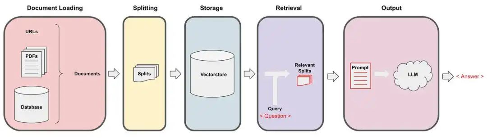
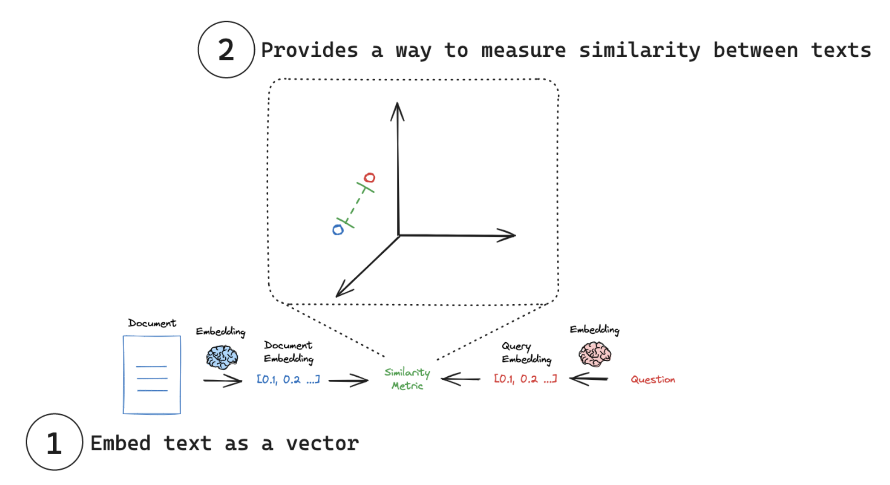
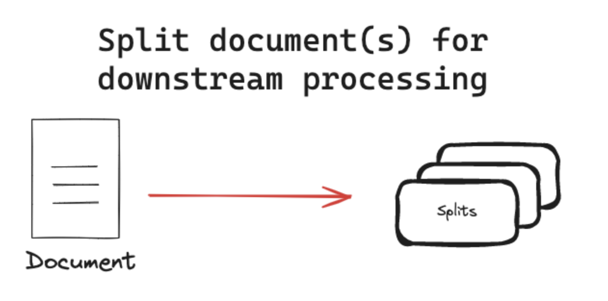
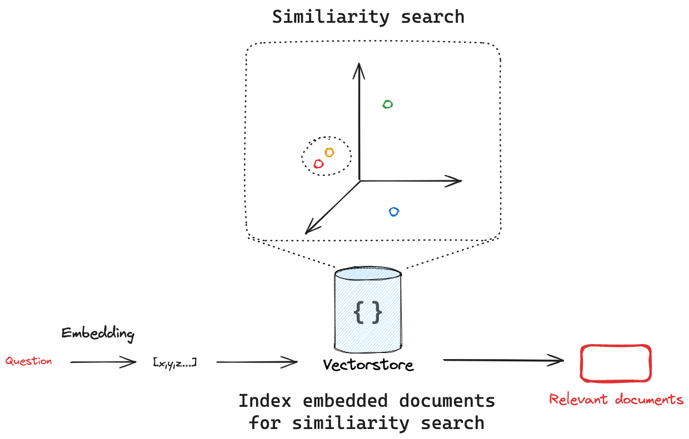

# LangChain 系列教程（三）：Retrieval

## 介绍

Retrieval 指的是**通过自然语言查询，从海量数据中检索相关信息**的过程。经常被应用于构建一个“私人的知识库”，构建过程更多的是将外部数据存储到知识库中。

细化这一模块的主要职能有四部分，其包括**数据的获取、整理、存储和查询**。如下图：


Retrieval 由几个部分组成：

- **Document Loaders**：负责从各种数据源加载数据，并将其格式化为“文档”（包含文本和相关元数据）。
- **Text Splitters**：用于对加载的文档进行转换，以适应应用程序的需求。
- **Embedding Models**：用于将文本转换为向量表示，这使得可以在向量空间中进行语义搜索等操作。
- **Vector Stores**：负责存储嵌入向量，并执行向量搜索。
- **Retrievers**：是一个接口，它根据非结构化查询返回文档。
- **Indexing**：索引API允许您从任何数据源加载并保持文档与向量存储的同步。



### Embedding Model(嵌入模型)

Embedding Model(嵌入模型)是一种将文本、图像等输入内容转化为**向量表示(vector representation)**的模型，它的主要目的是让机器能够“理解”和“比较”自然语言的语义。

常用的Embedding Model包括 OpenAI 的 text-embedding-ada-002、Sentence-BERT 系列、Cohere 多语言模型以及适配中文的 text2vec 和 bge 模型，广泛用于语义搜索、问答和推荐等任务。



在Embedding Model中，需要实现两个目标：
 - **将文本嵌入为向量**：将文本转换为数字向量表示。
 - **测量相似性**：使用简单的数学运算来比较嵌入向量，如**余弦相似度、欧几里得距离、点积**等。

### Text Splitters(文本拆分器)

Text Splitters(文本拆分器)将文档分割成更小的块，以便在下游应用程序中使用。

常见的文档切分策略包括基于长度、文本结构、文档结构和语义内容的切分，分别适用于不同场景以提升处理效率和语义准确性。



文本分割具有多种好处：
- **适应非统一长度的文档**：现实中的文档长度千差万别，统一切分后更便于处理。
- **避免模型输入限制**：大多数嵌入模型/语言模型有输入长度限制（如 token 数），切分可避免超限错误。
- **提高表示质量**：长文本会稀释语义，切分后每一段能更专注地表示其局部含义。
- **提升检索精度**：切分成更小的语义单元后，用户提问能精准匹配到相关片段。
- **节省资源**：小块文本更节省内存，并能并行处理，提高整体效率。

### Vector Stores(向量数据库)

Vector Stores(向量数据库)是一种支持基于向量检索的数据库，用于存储嵌入（embedding）向量，并能根据语义相似度高效检索相关数据（如文本、图像、音频等）。它是构建 RAG（Retrieval-Augmented Generation）系统的核心组件。

#### 为什么需要 Vector Store？

因为大语言模型（LLM）无法“记住”全部外部知识，所以我们需用 嵌入模型将文档转成向量，并存入 Vector Store，实现基于语义相似度的高效检索。这样可以帮助模型从海量文本中找出与用户提问“语义最相关”的部分，提升回答的准确性与上下文关联性。

#### Vector Store 的搜索过程



1. **文档嵌入**：将每段文档通过**拆分和嵌入模型**转化为向量，并存入向量数据库；

2. **问题嵌入**：用户提问也被嵌入为向量；

3. **相似度计算**：计算问题向量与所有文档向量之间的相似度（如余弦相似度）；

4. **返回结果**：取出最相似的 top-k 文档，作为回答依据。

### Retriever(检索器)

在 LangChain 中，**Retriever** 是一个接口组件，允许你使用自然语言查询从各种存储系统中检索相关文档。它是 RAG（Retrieval-Augmented Generation）系统的核心部分之一。

常见 Retriever 类型包括向量检索器（基于语义相似度）、关键词检索器（如 BM25/TF-IDF）、搜索 API 检索器（如 Wikipedia）、以及数据库检索器（如 SQL/图数据库），它们适用于不同的数据结构和查询需求。

每个retriever都需要实现以下基本方法：

```python
docs = retriever.invoke("你的问题")
```

- **输入**：一段查询文本（如："MCP 是什么？"）
- **输出**：一个文档列表（含内容和元信息）

#### 为什么需要 Retriever？

- LLM 本身无法访问外部知识，需要“检索器”从文档中找出**最相关的上下文**
- Retriever 的职责是**接收查询 → 返回语义相关的文档**
- 无论你使用的是向量库、SQL、图数据库或搜索 API，都可以通过统一接口调用

## 示例代码

